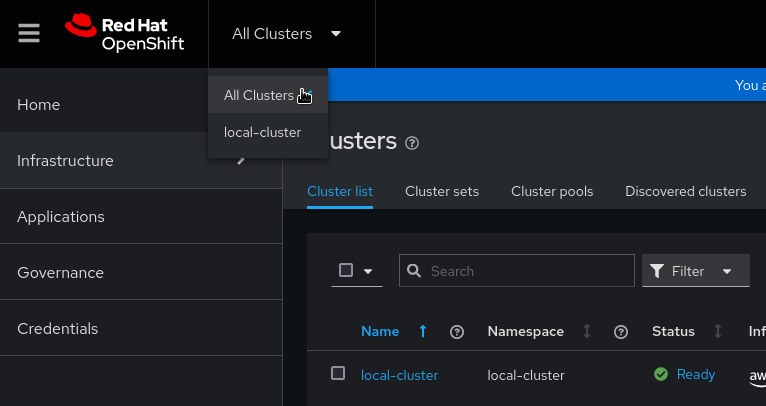
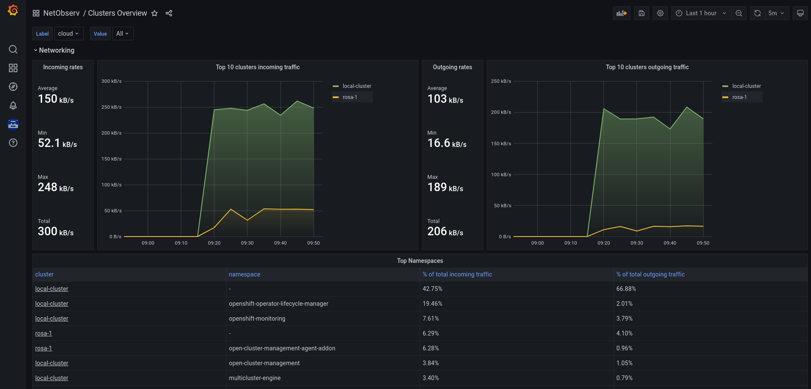

## Leveraging NetObserv metrics in ACM

### What is ACM?

(short presentation of ACM)

### What is NetObserv

(short presentation of NetObserv)

### How to combine them?

ACM has an Observability add-on that uses Thanos and Prometheus federation to pull some of the metrics from the monitored clusters, automatically injecting cluster name and ID as metric labels. It provides [an API](https://access.redhat.com/documentation/en-us/red_hat_advanced_cluster_management_for_kubernetes/2.8/html/observability/observing-environments-intro#adding-custom-metrics) to configure which additional metrics to pull.

On the other hand, NetObserv generates metrics out of the processed flow logs. They are pulled and stored by Prometheus, in each cluster where NetObserv is installed.

So it seems there is a match between ACM and NetObserv? Spoiler: yes, there is!

Let's set it up.

#### Pre-requisites

- A running cluster, configured as a hub with ACM. (insert doc link)
- Other clusters imported in ACM.
- NetObserv operator installed and configured on each cluster to monitor. Only the Red Hat operator can be used here, as ACM will only pull metrics from the OpenShift cluster monitoring operator - it doesn't work with OpenShift "user workload monitoring" mode. (TODO: check another time? / double-check with acm folks).

#### Configure NetObserv metrics

By default, NetObserv will configure a small set of metrics, namely:
- `namespace_flows_total`
- `node_ingress_bytes_total`
- `workload_ingress_bytes_total`

For the purpose of this article, we will enable more of them. Note that enabling more metrics may have a noticeable impact on Prometheus. You should monitor Prometheus resource usage when doing so.

If you're running NetObserv 1.4.x or older, edit the `FlowCollector` resource, find property `spec.processor.metrics.ignoreTags` and remove `egress` and `packets`.

If you're running NetObserv 1.5 or above, edit the `FlowCollector` resource, find property `spec.processor.metrics.includeList` and set it up with:
- `namespace_flows_total`
- `node_ingress_bytes_total`
- `workload_ingress_bytes_total`
- `workload_egress_bytes_total`
- `workload_egress_packets_total`
- `workload_ingress_packets_total`

This adds metrics used in later steps. [Take a look](https://github.com/netobserv/network-observability-operator/blob/main/docs/Metrics.md) at the available metrics if you want to customize this setup further.

#### Start the observability add-on

If you have already observability configured in ACM, you can skip this section.

Else, follow the instructions [documented here](https://access.redhat.com/documentation/en-us/red_hat_advanced_cluster_management_for_kubernetes/2.8/html/observability/observing-environments-intro#enabling-observability-service).

Proceed until you have created a `MultiClusterObservability` resource.

Before going ahead, makes sure the observability stack is up and running:

```bash
kubectl get pods -n open-cluster-management-observability -w
```

#### Configure pulling NetObserv metrics

This is done with a new ConfigMap that declares all metrics to be pulled from the federated Prometheus, along with recording rules:

```yaml
kind: ConfigMap
apiVersion: v1
metadata:
  name: observability-metrics-custom-allowlist
  namespace: open-cluster-management-observability
data:
  metrics_list.yaml: |
    rules:
    # Namespaces
    - record: namespace:netobserv_workload_egress_bytes_total:src:rate5m
      expr: sum(label_replace(rate(netobserv_workload_egress_bytes_total[5m]),\"namespace\",\"$1\",\"SrcK8S_Namespace\",\"(.*)\")) by (namespace)
    - record: namespace:netobserv_workload_ingress_bytes_total:dst:rate5m
      expr: sum(label_replace(rate(netobserv_workload_ingress_bytes_total[5m]),\"namespace\",\"$1\",\"DstK8S_Namespace\",\"(.*)\")) by (namespace)
    - record: namespace:netobserv_workload_egress_packets_total:src:rate5m
      expr: sum(label_replace(rate(netobserv_workload_egress_packets_total[5m]),\"namespace\",\"$1\",\"SrcK8S_Namespace\",\"(.*)\")) by (namespace)
    - record: namespace:netobserv_workload_ingress_packets_total:dst:rate5m
      expr: sum(label_replace(rate(netobserv_workload_ingress_packets_total[5m]),\"namespace\",\"$1\",\"DstK8S_Namespace\",\"(.*)\")) by (namespace)

    # Namespaces / cluster ingress|egress
    - record: namespace:netobserv_workload_egress_bytes_total:src:unknown_dst:rate5m
      expr: sum(label_replace(rate(netobserv_workload_egress_bytes_total{DstK8S_OwnerType=\"\"}[5m]),\"namespace\",\"$1\",\"SrcK8S_Namespace\",\"(.*)\")) by (namespace)
    - record: namespace:netobserv_workload_ingress_bytes_total:dst:unknown_src:rate5m
      expr: sum(label_replace(rate(netobserv_workload_ingress_bytes_total{SrcK8S_OwnerType=\"\"}[5m]),\"namespace\",\"$1\",\"DstK8S_Namespace\",\"(.*)\")) by (namespace)
    - record: namespace:netobserv_workload_egress_packets_total:src:unknown_dst:rate5m
      expr: sum(label_replace(rate(netobserv_workload_egress_packets_total{DstK8S_OwnerType=\"\"}[5m]),\"namespace\",\"$1\",\"SrcK8S_Namespace\",\"(.*)\")) by (namespace)
    - record: namespace:netobserv_workload_ingress_packets_total:dst:unknown_src:rate5m
      expr: sum(label_replace(rate(netobserv_workload_ingress_packets_total{SrcK8S_OwnerType=\"\"}[5m]),\"namespace\",\"$1\",\"DstK8S_Namespace\",\"(.*)\")) by (namespace)

    # Workloads
    - record: workload:netobserv_workload_egress_bytes_total:src:rate5m
      expr: sum(label_replace(label_replace(label_replace(rate(netobserv_workload_egress_bytes_total[5m]),\"namespace\",\"$1\",\"SrcK8S_Namespace\",\"(.*)\"),\"workload\",\"$1\",\"SrcK8S_OwnerName\",\"(.*)\"),\"kind\",\"$1\",\"SrcK8S_OwnerType\",\"(.*)\")) by (namespace,workload,kind)
    - record: workload:netobserv_workload_ingress_bytes_total:dst:rate5m
      expr: sum(label_replace(label_replace(label_replace(rate(netobserv_workload_ingress_bytes_total[5m]),\"namespace\",\"$1\",\"DstK8S_Namespace\",\"(.*)\"),\"workload\",\"$1\",\"DstK8S_OwnerName\",\"(.*)\"),\"kind\",\"$1\",\"DstK8S_OwnerType\",\"(.*)\")) by (namespace,workload,kind)
```

We could configure it to directly pull the NetObserv metrics, however we choose here another option, using recording rules: it allows us to reduce the metrics cardinality by doing some filtering and/or aggregations. Typically, NetObserv metrics have labels for traffic sources and destinations. The cardinality of such metrics grows potentially as `N²`, where `N` is the number of workloads in the cluster. This could be huge with multiple clusters, and we don't need this level of details in multi-cluster wide dashboards.

So we are reducing the workload metrics cardinality to `2N` by storing independently `ingress` metrics (per destination, without the source) and `egress` metrics (per source, without the destination).

Create this `ConfigMap` in your hub cluster - the one where the ACM operator is installed:

```bash
kubectl apply -f https://raw.githubusercontent.com/netobserv/documents/main/examples/ACM/netobserv-metrics.yaml
# TODO: remove before merging
# kubectl apply -f https://raw.githubusercontent.com/jotak/netobserv-documents/acm/examples/ACM/netobserv-metrics.yaml
```

This config will be immediately picked up by the metrics collector. To make sure everything worked correctly, you can take a look at these logs:

```bash
kubectl logs -n open-cluster-management-addon-observability -l component=metrics-collector -f
```

Hopefully you should see an info log such as: `Metrics pushed successfully`. If there are some typos or mistakes in the ConfigMap, you would see an error in these logs.

#### Installing the dashboards

We've built two dashboards for the set of metrics configured:

- One showing Clusters Overview
- Another showing more details per cluster

To install them:

```bash
kubectl apply -f https://raw.githubusercontent.com/netobserv/documents/main/examples/ACM/dashboards/clusters-overview.yaml
kubectl apply -f https://raw.githubusercontent.com/netobserv/documents/main/examples/ACM/dashboards/per-cluster.yaml
# TODO: remove before merging
# kubectl apply -f https://raw.githubusercontent.com/jotak/netobserv-documents/acm/examples/ACM/dashboards/clusters-overview.yaml
# kubectl apply -f https://raw.githubusercontent.com/jotak/netobserv-documents/acm/examples/ACM/dashboards/per-cluster.yaml
```

#### Viewing the dashboards

From the hub cluster console, select the "All Clusters" view:



Click the Grafana link:


The new dashboards are in the "NetObserv" directory:


1. NetObserv / Clusters Overview


_Clusters overall in/out stats and top namespaces_


_Clusters in/out external traffic_

2. NetObserv / Per Cluster


_Top namespaces charts_


_Namespaces and Workloads tables_

These dashboards provide high level views on cluster metrics. To dive more in the details, such as for troubleshooting or performance analysis, it is still be preferable to use the NetObserv plugin or metrics on a given cluster, via the OpenShift Console: not only the metrics are more accurate there, with less aggregation and a better resolution, but there are also more details available in the raw flow logs that aren't visible in metrics, such as pod/port/IP/interface information per flow and accurate timestamps.

#### It's on you

You can customize these dashboards or create new ones. [This documentation](https://access.redhat.com/documentation/en-us/red_hat_advanced_cluster_management_for_kubernetes/2.8/html/observability/using-grafana-dashboards#setting-up-the-grafana-developer-instance) will guide you through the steps of creating your own dashboards.

For instance, do you want to track workloads having external traffic, which we haven't done in this article? You can just adapt the rules defined above. If you look at them closely, you'll notice they're all really using the same four metrics under the cover: `netobserv_workload_egress_bytes_total`, `netobserv_workload_ingress_bytes_total` and their equivalent for packets. To track per-workload external traffic, we can use them again, and as for namespaces, filter on empty `SrcK8S_OwnerType` or `DstK8S_OwnerType`. This trick stands for: NetObserv hasn't been able to identify any in-cluster resource corresponding to this source or destination, so this is likely a cluster-external caller or service.

We would end up with these two new rules:

```yaml
    - record: workload:netobserv_workload_egress_bytes_total:src:unknown_dst:rate5m
      expr: sum(label_replace(label_replace(label_replace(rate(netobserv_workload_egress_bytes_total{DstK8S_OwnerType=\"\"}[5m]),\"namespace\",\"$1\",\"SrcK8S_Namespace\",\"(.*)\"),\"workload\",\"$1\",\"SrcK8S_OwnerName\",\"(.*)\"),\"kind\",\"$1\",\"SrcK8S_OwnerType\",\"(.*)\")) by (namespace,workload,kind)
    - record: workload:netobserv_workload_ingress_bytes_total:dst:unknown_src:rate5m
      expr: sum(label_replace(label_replace(label_replace(rate(netobserv_workload_ingress_bytes_total{SrcK8S_OwnerType=\"\"}[5m]),\"namespace\",\"$1\",\"DstK8S_Namespace\",\"(.*)\"),\"workload\",\"$1\",\"DstK8S_OwnerName\",\"(.*)\"),\"kind\",\"$1\",\"DstK8S_OwnerType\",\"(.*)\")) by (namespace,workload,kind)
```

Be careful about escaping double-quotes, though it's not very pretty, it is necessary: else you would end up with a parsing error. Also, the `label_replace` chained calls here could be avoided as they look messy, but they make it actually easier to manipulate those metrics later on, in Grafana.

Also, don't forget that [NetObserv has more metrics to show](https://github.com/netobserv/network-observability-operator/blob/main/docs/Metrics.md). And just for teasing, we are working on a fresh new API in NetObserv that will soon let you build pretty much any metric you want out of flow logs, for even more dashboarding possibilities.
