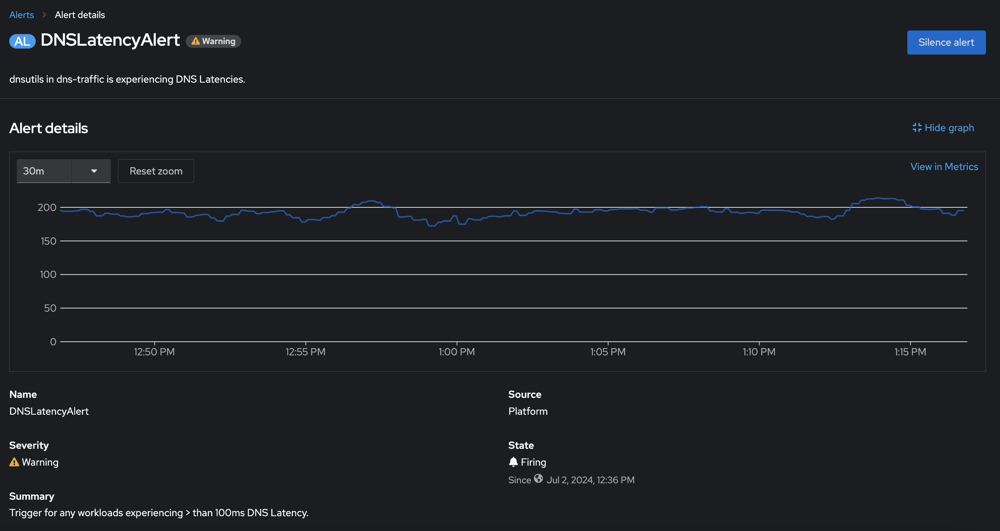

# Network Observability without Loki

By: Mehul Modi, Steven Lee

Recently, Network Observability operator 1.6 released a major enhancement to provide network insights for your OpenShift cluster without Loki. This enhancement was also featured in [What's new in Network Observability 1.6](../whats_new_1.6) blog providing quick overview of the feature. In this blog, lets look at some of the advantages and trade-offs users would have when deploying network observability with Loki disabled.

# Configure Network Observability without Loki
Loki as datasource is currently enabled by default. To configure Network Observability operator without Loki, when configuring Flowcollector resource simply set `.spec.loki.enable` to `false`

```yaml
loki:
  enable: false
```

## Performance and Resource utilization gains

### Query performance:
<TODO: note faster query performance data when compared to loki here>

### Resource utilization:
In our tests conducted on 3 different test beds with varied workloads and network throughput, when Network Observability is configured without Loki, total savings of Memory usage could be in range 12-60% and CPU utilzation could be lower by 20-30%<sup>*</sup>. Not to mention you will not need to provision and plan for additional storage in public clouds for Loki, overall reducing the cost and improving operational efficiency significantly.

In our perf tests, [kube-burner](https://github.com/kube-burner/kube-burner) workloads were used to generate several objects and create heavy network traffic. We used sampling rate of 1 for all below tests. To further describe each test bed:

1. Test bed 1: node-density-heavy workload ran against 25 nodes cluster.
2. Test bed 2: ingress-perf workload ran against 65 nodes cluster.
3. Test bed 3: cluster-densit-v2 workload ran against 120 nodes cluster

Below graphs shows total vCPU and memory usage for a recommended Network Observability stack (flowlogs-pipeline, eBPF-agent, Kafka and optionally Loki) for production clusters.


 consumed.png>)

<sup>*</sup> actual resource utilization may depend on various factors such as flowcollector sampling size, number of workloads and nodes in an OCP cluster

This comes with couple of trade-offs though, without storage of network flows it no longer provides Traffic flows table. Also, per-pod level of resource granularity is not available since it causes prometheus metrics to have high cardinality. However, should you need per-pod or per-flow level of granularity for diagnostic and troubleshooting needs, enabling loki should be pretty straightforward and both datasources can be used. When both loki and prometheus datasources are enabled, while querying on Netflow Traffic page, prometheus queried data over will be used wherever possible since it offers faster performance.

## Accessing Netflow Traffic for non-admins:
While prometheus currently doesn't supports multi-tenancy in a way that Loki does in an OpenShift cluster, non-admin users can be added to `cluster-monitoring-view`. For example, below command can be used to enable prometheus metrics visualizing for `testuser-0` user.

`oc adm policy add-cluster-role-to-user cluster-monitoring-view  testuser-0`

## Network Observability metrics use case:
Let's look at a scenario how users can benefit from metrics published by Network Observability Operator. For instance, if you suspect anamaly with DNS lookups in your cluster and want to investigate workloads that may be facing DNS latencies. With Network Observability's `DNSTracking` feature and enriched prometheus metrics you can quickly set up an alert to trigger on high DNS latencies.

For example, below alert will trigger for any workloads that experiences DNS latency > 100ms: 
```yaml
apiVersion: monitoring.coreos.com/v1
kind: PrometheusRule
metadata:
  name: dns-latency-alert
spec:
  groups:
  - name: DNSLatencyAlert
    rules:
    - alert: DNSLatencyAlert
      annotations:
        message: |-
          {{ $labels.DstK8S_OwnerName }} in {{ $labels.DstK8S_Namespace }} is experiencing DNS Latencies.
        summary: "Trigger for any workloads experiencing > than 100ms DNS Latency."
      expr: topk(7, (histogram_quantile(0.9, sum(rate(netobserv_workload_dns_latency_seconds_bucket{SrcK8S_Namespace!=""}[2m])) by (le,SrcK8S_Namespace,SrcK8S_OwnerName,DstK8S_Namespace,DstK8S_OwnerName))*1000> 100) or (histogram_quantile(0.9, sum(rate(netobserv_workload_dns_latency_seconds_bucket{DstK8S_Namespace!=""}[2m])) by (le,SrcK8S_Namespace,SrcK8S_OwnerName,DstK8S_Namespace,DstK8S_OwnerName))*1000 > 100))
      for: 10s
      labels:
        severity: warning
```

To demonstrate this use-case, I configured CoreDNS's [erratic plugin](https://coredns.io/plugins/erratic/) in openshift-dns to add latencies for `example.org` domain using below config:

```
example.org {
        erratic {
            delay 2 100ms
        }
}
```

Above config add 100ms delay to every 2nd DNS request coming in for example.org. A test pod performing DNS lookups for `example.org` every 1 second was created, eventually triggering earlier configured `DNSLatencyAlert` in my OCP cluster.



Similarly, additional alerts on different DNS response codes could be set up, for example an alert for DNS lookup failures such as DNS queries receiving NXDOMAIN or SERVFAIL can also be set up as flowlogs and metrics are already enriched with DNS response codes.

In addition to metrics for `DNSTracking` feature, Network Observability provides metrics for other features such as Round-Trip-Times and Packet Drops as well.

## Conclusion and next steps:

Network Observability operator provides the visibility you need to proactively detect issues with OpenShift cluster networking. Now with an option to disable loki, Network Observability operator provides light weight solution to visualize, diagnose and troubleshoot networking issues faster at a lower cost. Network Observability's prometheus metrics can be leveraged to set up user defined alerts in your OCP cluster.

While some feature parity gap exists when compared to configuration with Loki enabled, team is actively working to close that gap and enhance this feature by enabling visualization for packet drops and better Prometheus multi-tenancy.

Whether you have already deployed or considering to deploy it, we'd love to engage with you and hear your thoughts [here](https://github.com/netobserv/network-observability-operator/discussions).
