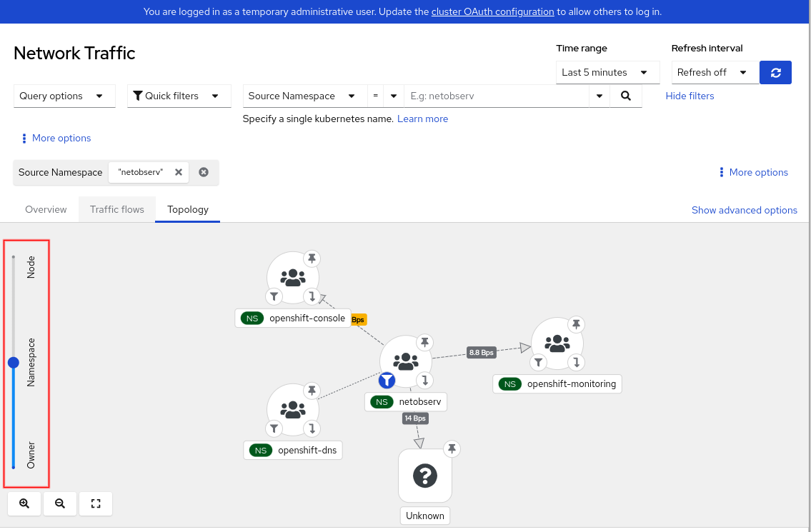
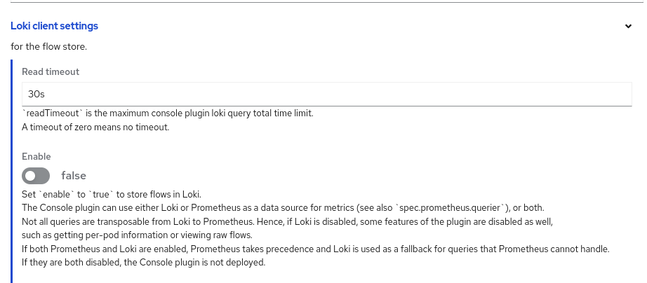
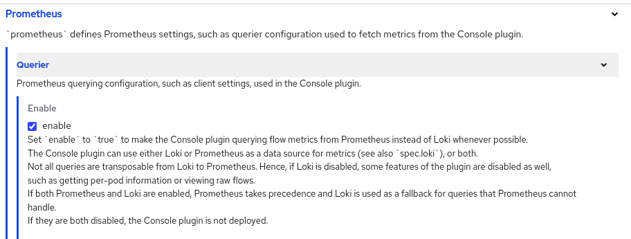

# What's new in Network Observability 1.6

Network Observability 1.6 was released on June 17, 2024.  Despite the usual bump in the minor version from 1.5, this is a significant release that could lower the barrier to adoption into production.

But before we go further into this, for those of you new to Network Observability, NetObserv, for short, is an optional operator that provides a slew of capabilities to track and provide insight into your network traffic flows.  While it works on any Kubernetes cluster, it works even better in an OpenShift environment, which is what I will focus on in this article.  I will only discuss the new features in this release so if you want the full feature list, read the documentation on [About Network Observability](https://docs.openshift.com/container-platform/4.16/observability/network_observability/network-observability-overview.html).

## Graphs and Logs Without Loki and Storage
Let's get right to the crux of the issue.  Ever since 1.3, NetObserv required an external component called Loki as well as storage, such as an S3 bucket, to store logs.  These flow logs allowed NetObserv to provide a rich UI to display graphs, tables, and a topology.  The resources required by Loki can be significant, particularly if you have lots of traffic and are sampling all data, not to mention the storage required.  With 1.4, if you have your own observability platform and only need the flow logs data, you can simply export this data and not install Loki or provide storage.  When you do this, you essentially get no UI besides some minimal flow metrics in **Observe > Dashboards**, because the expectation is that your platform will provide the features and the visuals.

This release changes that premise.  It brings back the graphs in the **Overview** panel and the topology in the **Topology** panel.  This is huge because the core of Network Observability is now fully functional at a fraction of the resources required when Loki is used!  It achieves this by creating Prometheus metrics from the flows and storing them at 5-minute intervals.

So what's the catch?  Without storing the flow logs as JSON data, there will be some impact.  The most notable is that there won't be a traffic flows table because flows are no longer stored (Figure 1).

_
Figure 1: Traffic flows grayed out
_

The other point to understand is that the metrics don't have information at the pod level so for example, in the topology, the **Resource** scope, which shows the pod to pod/service communication, will not exist (Figure 2).

_
Figure 2: Topology - No "Resources"
_

A couple of other features, namely packet drop reason and multi-tenancy, are not supported but will be addressed in the next release.  If you need any of these capabilities, then go ahead and install Loki and provide storage as usual.

Let's walk through how to configure a Loki-less setup.  Install the Network Observability Operator.  In **Operators > Installed Operators**, click the **Flow Collector** link, and then **Create FlowCollector**.  Click **Loki client settings** to open this up (Figure 3).

_
Figure 3: Loki client settings
_

By default, Loki is enabled so set **Enable** to false.  That's it!

There is one other note worth mentioning.  Even if you do install Loki, by default, it will favor using the metrics instead of Loki for querying whenever possible.  By doing this, not only will it be faster, but it will allow querying data over a period of weeks or months.  This behavior can be changed under **Prometheus**, **Querier** in the **Enable** setting (Figure 4).

_
Figure 4: Prometheus settings
_

